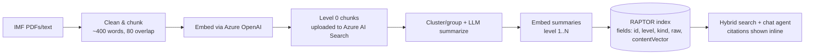

#RAPTOR on Azure AI Search 🌲🔍

RAPTOR is a successful RAG pattern that tries to mitigate the fragmentation problem in RAG. 
This is when you have a very large document corpus, which causes RAG performance challanges when a flat vector index is used.
For more on RAPTOR go here...

## Highlights
- 🌲 **RAPTOR index on Azure AI Search** with `level` + `kind` fields so you can target summaries or leaves per query.
- 🧭 **Built for sparsity/fragmentation** across long PDFs—recovers the global argument before citing the right paragraphs.
- 🤖 **CLI chat agent** that runs hybrid search (text + vector) and cites sources.
- 🧪 **Multiple ingestion modes**: baseline flat index, contiguous RAPTOR, semantic-clustered RAPTOR.
- 📦 **IMF WEO data included** under `data/` for instant experimentation.

## What is RAPTOR? (from the deck)
- “When the answer is the forest, not a tree.” Flat RAG over 80+ page manuals/legal filings surfaces isolated leaves; RAPTOR retrieves the right abstraction level first, then drills down.
- Builds a *summary tree* (e.g., depth ≈ 3, fan-out ≈ 8). Queries often match level-1/2 summaries, then expand into 1–2 leaves for grounding—avoids “summary says X but the leaf is elsewhere.”
- Indexing flow used here mirrors the slides: clean text → chunk (sentence-aware, ~400 words, 80-word overlap) → embed → cluster/group → LLM summarize → re-embed → repeat until a root summary appears.
- Retrieval tips from the presentation:
  - Filter to summaries (`kind eq 'summary'` or `level gt 0`) when you need synthesis; query leaves for precise parameters/IDs.
  - Two-pass works well: hit summaries, pick a subtree, then fetch children for citations.

## Architecture (at a glance)

## Repository map
- `src/ingest_imf_baseline.py` — flat hybrid/vector index from all `data/IMF_*.pdf`.
- `src/ingest_imf_raptor_index.py` — RAPTOR tree over all IMF PDFs (keeps `doc_id`, `level`, `kind`).
- `src/ingest_raptor.py` — RAPTOR tree over one text file (latest `IMF_*.txt` by default).
- `src/ingest_raptor_semantic_clustering.py` — RAPTOR with semantic clustering (nearest-neighbor grouping).
- `src/agent_chat.py` — CLI chat; hybrid search against `imf_baseline` or `imf_raptor`.
- `data/` — IMF WEO PDFs + extracted text; `docu/` — slide decks used for references.
- `.env.example` — Azure settings to copy/populate.

## Quick start
1) **Environment**: `python3 -m venv .venv && source .venv/bin/activate`  
   (Scripts use stdlib + `pdftotext`; install `agent-framework` if you prefer the official package over the shim.)
2) **Azure config**: copy `.env.example` → `.env` and fill `AZURE_OPENAI_*`, `AZURE_TEXT_EMBEDDING_DEPLOYMENT_NAME`, `AZURE_SEARCH_ENDPOINT`, `AZURE_SEARCH_ADMIN_KEY` (or `AZURE_SEARCH_KEY`), and desired index names (`AZURE_SEARCH_INDEX_NAME`, `RAPTOR_INDEX`).
3) **Data**: keep IMF PDFs/text under `data/` (already included); or point `IMF_TEXT_PATH` to a custom file.

## Build indexes
- Flat baseline (hybrid search):  
  `python3 src/ingest_imf_baseline.py`  → index `imf_baseline` (by default).
- RAPTOR over all IMF PDFs (contiguous grouping):  
  `python3 src/ingest_imf_raptor_index.py`  → index `imf_raptor` with `level/kind/doc_id`.
- RAPTOR over a single text source (latest IMF text):  
  `python3 src/ingest_raptor.py`
- RAPTOR with semantic clustering (group by embedding proximity):  
  `python3 src/ingest_raptor_semantic_clustering.py`

## Chat with the index
- Baseline: `python3 src/agent_chat.py`  
- RAPTOR: `python3 src/agent_chat.py imf_raptor` (optionally `DOC_ID_FILTER=IMF_2410` to scope).  
The agent prints retrieved context (hybrid text + vector) and answers with citations.

## When to reach for RAPTOR
- Long manuals/policies where the “story” spans multiple sections.
- Cross-document synthesis (multi-report, multi-year views) such as comparing inflation paths across economies.
- Fragmented evidence: you need both the high-level narrative *and* one or two grounding paragraphs.
- Sparse domains: imposing hierarchy (RAPTOR) outperforms endless prompt engineering.

## Retrieval playbook
- Prefer summary nodes for open-ended questions; use leaves for numeric/ID lookups.
- If summaries mix with leaves, add a filter (`level gt 0`) or run a two-pass: summaries → children.
- Use `doc_id` filters to stay within a report when needed; drop the filter for cross-report synthesis.
- Hybrid search is on by default (text + vector); keep queries natural-language for best hits.
